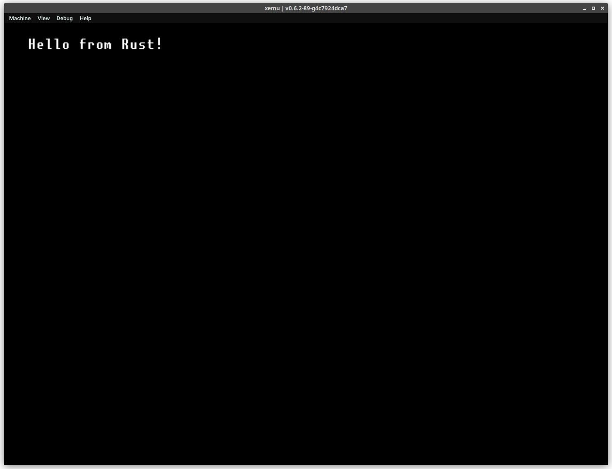

# nxdk-rs

nxdk-rs aims to provide a set of bindings and a build system to allow Rust programs to run on the Original Xbox, through the use of [nxdk](https://github.com/XboxDev/nxdk).

nxdk-sys consists of bindings generated by bindgen, as well as a build script that links against the nxdk. It is re-exported by nxdk-rs.

## Usage

nxdk-rs requires that [nxdk](https://github.com/XboxDev/nxdk) is installed somewhere on your system. If you don't already have it, then clone it along with this repo:

```sh
git clone --recursive https://github.com/XboxDev/nxdk
git clone https://github.com/antangelo/nxdk-rs
```

You'll also need Rust nightly installed:

```sh
rustup install nightly
rustup component add rust-src --toolchain nightly-x86_64-unknown-linux-gnu
```

Ensure that you follow the nxdk installation instructions. In particular, you'll need to run the activation script:

```sh
./nxdk/bin/activate
```

This is all that is needed to use nxdk-rs. At this point, you can build one of the nxdk-rs samples:

```sh
cd nxdk-rs/examples/helloworld
make
```

With any luck, you should see the `bin.iso` and `bin/default.xbe` output. FTP the xbe to a real Xbox, or run the iso from xemu directly:

```sh
xemu -dvd_path bin.iso
```



## License

As these are primarily bindings, they'll be licensed under the same license as the underlying nxdk component:

- OpenXDK (hal) under GPLv2
- pbkit under MIT
- pdclib under CC0
- LLVM compiler-rt under MIT

Code that is unrelated to nxdk libraries themselves is licensed under MIT (this is primarily the `i386-xbox-win32.json` target triple and memory allocator).

If the nxdk licenses are changed (which has happened recently), I intend to relicense parts of nxdk-rs accordingly. Please keep this in mind if you are making contributions.
